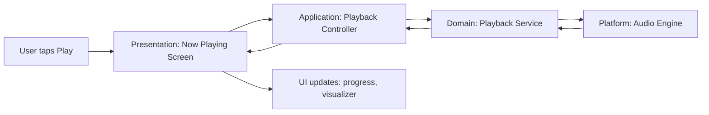

# Architecture Overview

## Zivybb — Local Music Player Application

## 1. Architectural Style

Zivybb follows a **layered, feature-first architecture** within a single Flutter application:

```
┌─────────────────────────────────────────┐
│           Presentation Layer             │  Screens, widgets
├─────────────────────────────────────────┤
│           Application Layer              │  Controllers / state notifiers
├─────────────────────────────────────────┤
│              Domain Layer                │  Business logic, entities
├─────────────────────────────────────────┤
│               Data Layer                 │  Repositories, data sources
├─────────────────────────────────────────┤
│         Platform / Device Layer          │  File system, audio engine, storage
└─────────────────────────────────────────┘
```

Each feature (playback, library, playlists, visualizer, mood tagging, backup, tag editor, settings) implements its own presentation and application layers, sharing common domain models and data-layer repositories where relevant. This mirrors the structure in `Folder-Structure.md`.

## 2. Key Architectural Decisions

| Decision | Rationale |
|---|---|
| No backend/server for Version 1 | App is local-only; all data lives on-device. Simplifies scope and avoids account/auth complexity before public release is even planned. |
| Local storage for library metadata, playlists, tags, settings | Avoids re-scanning the full device library on every launch; supports fast backup/restore. |
| Feature-first folder structure | Keeps related UI, state, and logic together, making it easier for a single developer to work on one feature at a time. |
| Background-safe file scanning | Missing-file detection and initial library scans must not block the UI thread — required by SRS N-3. |
| Themeable UI from day one | Color customization is a core feature (not an afterthought), so theming is built into the design system rather than retrofitted. |

## 3. Data Flow (Typical Playback Interaction)



## 4. Persistence Strategy

- **Library metadata (songs, folders):** cached locally after the initial device scan; refreshed incrementally rather than fully re-scanned on every launch.
- **User data (playlists, favorites, mood tags, settings):** stored in local structured storage, designed to be easily serialized for the Backup feature.
- **Backups:** exported as a self-contained file that can be restored later; format finalized during Week 4 of the Development Plan.

See `Entity-Diagrams-UML.md` for the full entity model.

## 5. Audio Engine Considerations

- The audio engine must support gapless playback and crossfade natively or via a wrapper layer — this is a key evaluation criterion when selecting the underlying Flutter audio package during Week 1 setup.
- Beat/amplitude data needed for the visualizer should be sourced from the same audio pipeline to avoid double-processing the audio stream.

## 6. Extensibility for Future Versions

The architecture deliberately isolates local-only assumptions so that streaming integration (a Future Consideration in `SRS.md`) could later be introduced as a new data source implementing the same repository interfaces used for local files — without rewriting the presentation or application layers.

## 7. Non-Goals for Version 1

- No multi-user or account system.
- No network calls of any kind (fully offline-capable by design).
- No cross-device sync (explicitly deferred per `SRS.md` Section 5).
