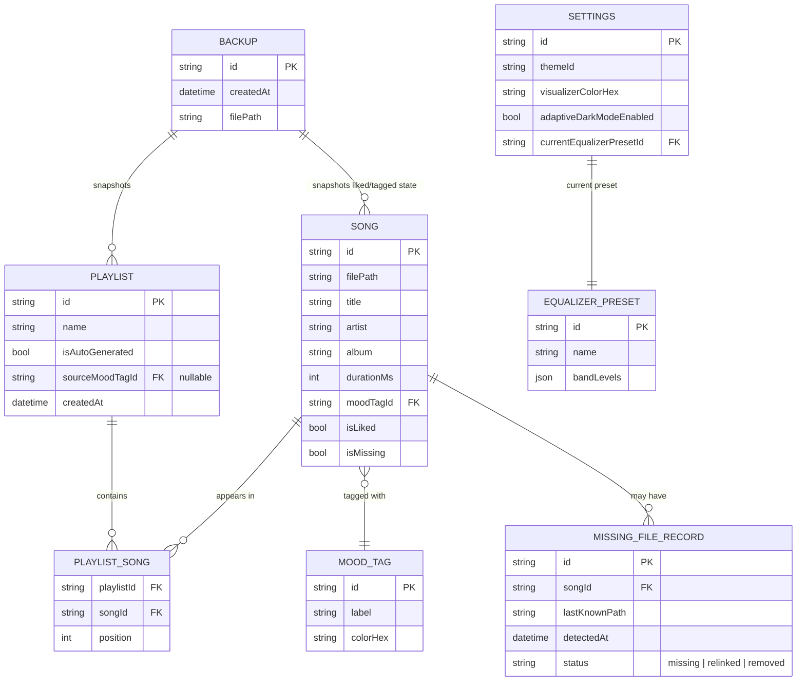
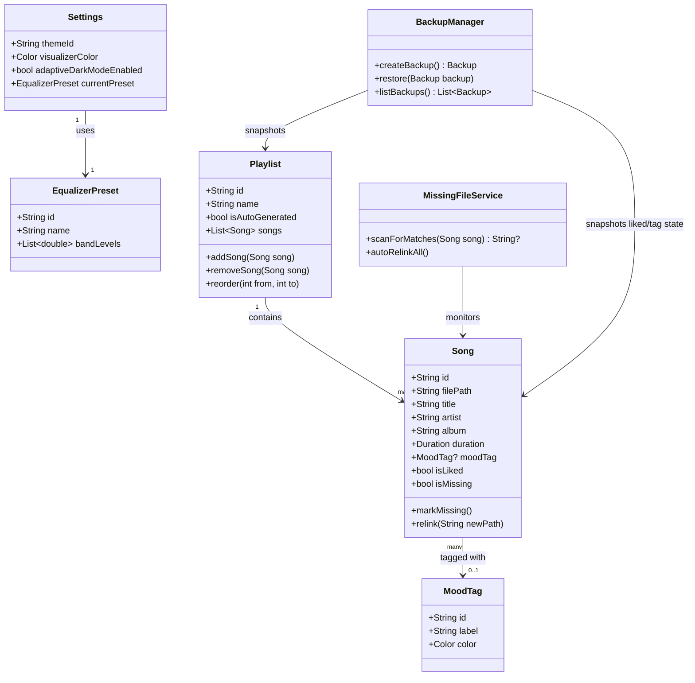
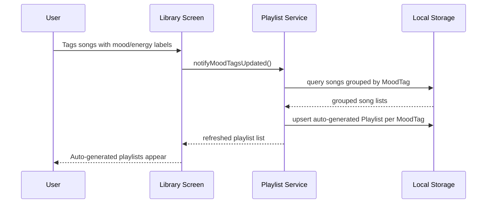
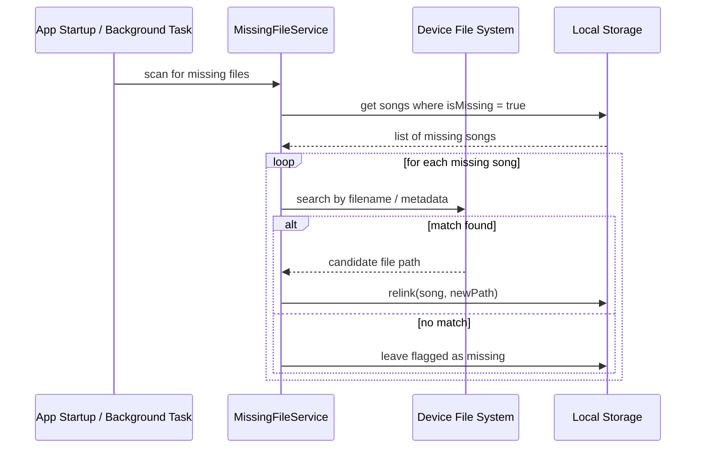

# Entity Diagrams / UML

## Zivybb — Local Music Player Application

This document defines the core data entities for Version 1 and their relationships, along with a high-level class view of the main domain objects. Diagrams use [Mermaid](https://mermaid.js.org/) syntax, which renders natively on GitHub.

## 1. Entity-Relationship Diagram

## 2. Domain Class Overview

## 3. Auto-Generated Playlist Flow (Sequence)

## 4. Missing File Detection Flow

## Notes

- `PLAYLIST_SONG` is the join entity supporting many-to-many between `PLAYLIST` and `SONG`, with an explicit `position` field to preserve manual ordering.
- Auto-generated playlists (`isAutoGenerated = true`) are derived from `MOOD_TAG` groupings and are regenerated rather than manually edited.
- `BACKUP` stores a serialized snapshot; the exact serialization format (JSON file, SQLite export, etc.) is an implementation decision to be finalized during Week 4 (Backup/Restore) of the development plan.
